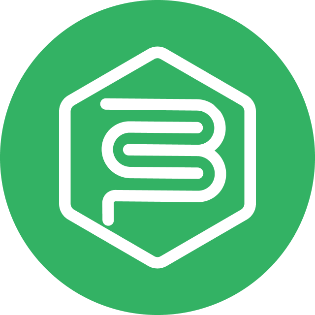

#  The Chatbot

> _A versatile, general-purpose chatbot platform designed for experimentation and personal utility._

Welcome to **The Chatbot**.

## About the Project

This project is a general-purpose digital assistant and a playground for implementing various features and ideas. It is designed to handle a wide range of tasks, from tracking expenses in Google Sheets to managing WhatsApp conversations. The goal is to build a flexible system that can evolve with new requirements and experiments.

## Architecture & Design

The project follows a clean and direct architecture, prioritizing simplicity and control over abstraction.

### Architecture Overview

The application follows a standard flow:
`Controller` -> `Service` -> `Entity`

- **Controllers**: Handle HTTP requests and responses.
- **Services**: Orchestrate business logic and manage data flow.
- **Entities**: Represent the core domain objects and logic.

### Domain Model

We avoid "Anemic Domain Models". Taking inspiration from **Domain-Driven Design (DDD)**, entities contain their own behavior and validation logic.

- A `Chat` is responsible for adding users.
- A `User` manages their own credentials.
  Logic resides where the data lives, ensuring that entities maintain valid states.

### Data Access Strategy

To keep the codebase simple and explicit, the Repository and Mapper patterns are not used.

- **Database Queries**: SQL queries are written directly inside `Services` as `private` methods.
- **SQL**: We use raw SQL to maintain full control over performance and complexity.
- **Entity Framework**: Used exclusively for **Migrations** and database configuration. It is not used as an ORM.

### Integrations & MCP

- **WhatsApp**: The primary user interface. The system hooks into the WhatsApp Business API to send and receive messages.
- **MCP (Model Context Protocol)**: Used to standardize how the AI interacts with external tools (like the database or Google APIs). This allows the conversation logic to dynamically invoke services as needed.
- **Google Ecosystem**: Deep integration with Google Auth for identity and Google Sheets for data management.

## Running the Project

### Prerequisites

- .NET SDK (8.0 or 9.0)
- Docker and Docker Compose
- Node.js and npm (for `concurrently`)
- ngrok (for local development with webhooks)

### Installation

Install required .NET tools globally:

```bash
make install-tools
```

Install Node.js dependencies:

```bash
make install-app
```

### Local Development

Run with hot-reload and ngrok tunnel:

```bash
make run-local
```

This command:

1. Starts Docker services (Postgres)
2. Applies migrations
3. Runs `dotnet watch`
4. Starts ngrok tunnel

**URLs:**

- Local: `http://localhost:8080`
- Public: `https://parrot-fun-nicely.ngrok-free.app` (ngrok)

### Running Tests

```bash
make test-local    # Local environment
make test-dev      # Development environment
make test-prev     # Preview environment
```

For watch mode:

```bash
cd Tests && make test-local
```

### Database Management

**Create Migration:**

```bash
make migrations-create name=MyNewFeature
```

**Apply Migrations:**

```bash
make migrations-up              # Current env
make migrations-up env=Local    # Specific env
```

**Rollback:**

```bash
make migrations-down
```

### Docker Deployment

```bash
make docker-up    # Build and start
make docker-down  # Stop and remove
```

## TODOS

### Infra

- [x] **Automated Tests** Create integration tests project.
- [x] **Tests to CI** Integrate tests into Github Actions CI.
- [x] **Database** Implement database integration.
- [x] **Error** Implement generic error handling.
- [x] **Migration** Define migration infra.
- [x] **Architecture** Define the MVC like architecture where Services and Entities represent the Model.

### Status

- [x] **Status Endpoint** Create status endpoint entries.
- [x] **Database Status** Version, Connections, etc.
- [ ] **Messaging Status** WhatsApp Status.

### Authentication

- [x] **Database Auth** Define auth structure.
- [x] **Get login URL** Generate Google OAuth2 URL.
- [x] **Authenticate via Google** Exchange code for tokens.
- [x] **Token Refresh** Auto-refresh tokens.
- [x] **Thank You Page** Redirect after login.

### Sheets Integration

- [x] **Open Spreadsheet by URL** Fetch/cache metadata.
- [x] **Define Resources & Types** Model spreadsheet structures.
- [x] **Add Expense Entry** Append cost data.
- [x] **Retrieve Data** Get recent entries/totals.

### Messaging

- [x] **Start Message** Send initial greeting.
- [x] **Standard Message** Send text responses.
- [x] **Option Message** Send choices/buttons.
- [x] **Receive & Process** Handle incoming messages.

### Migration

- [x] **List Pending Migrations** List pending migrations.
- [x] **Run Pending Migrations** Run pending migrations.
- [x] **Reset Migrations** Reset migrations.

### Last tasks before v1

- [x] Fix URI ToString showing the port
- [x] Make it safer
- [x] Create a welcome page
- [x] Create a privacy policy page
- [x] Create structure for allowed phone numbers
- [x] Create a way to reset chat keeping history
- [x] Add the logo for this readme
- [x] Add migration endpoint
- [x] Add a readme for this project

### For later

- [ ] Use logging services.
- [ ] **Optimize Sheets** improve performance by using the database as a SOT.
- [ ] Refactor database with `IDbContextFactory<AppDbContext>`.
- [ ] Add tests forcing refresh token.

### Task Management

- [ ] **Create Task** Add a new task.
- [ ] **Complete Task** Complete by name.
- [ ] **List Task Lists** Retrieve all lists.
- [ ] **List Tasks** Fetch all tasks.
