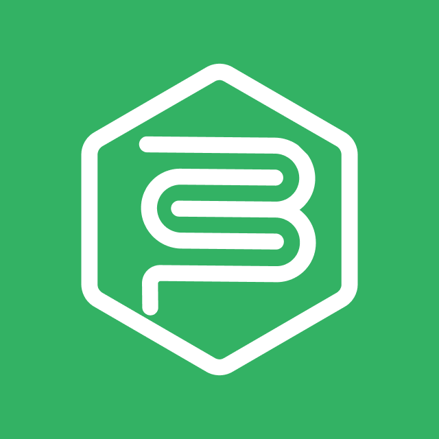

# The Chatbot 

## Running the project

This document provides instructions for running the project, executing tests, and managing the development environment.

### Prerequisites

- .NET SDK (8.0 or 9.0)
- Docker and Docker Compose
- Node.js and npm (for `concurrently`)
- ngrok (for local development with webhooks)

### Installation

Install required .NET tools globally:

```bash
make install-tools
```

Installs `dotnet-ef` and `dotnet-script`.

Install Node.js dependencies:

```bash
make install-app
```

Installs `concurrently` for running multiple commands.

### Local Development

Run with hot-reload and ngrok tunnel:

```bash
make run-local
```

Automatically starts Docker services, applies migrations, runs `dotnet watch` with `ASPNETCORE_ENVIRONMENT=Local`, and starts ngrok on port 8080.

Available at:

- Local: `http://localhost:8080`
- Public: `https://parrot-fun-nicely.ngrok-free.app`

### Running Tests

Run tests for different environments. All commands automatically ensure services are ready:

```bash
make test-local    # Local environment
make test-dev      # Development environment
make test-prev     # Preview environment
```

For watch mode (continuous testing), navigate to `Tests` directory:

```bash
cd Tests
make test-local    # or test-dev, test-prev
```

### Database Management

Create a migration:

```bash
make migrations-create name=<MigrationName>
```

Apply migrations (uses current system environment if `env` is not specified):

```bash
make migrations-up              # Uses current ASPNETCORE_ENVIRONMENT
make migrations-up env=Local
make migrations-up env=Development
make migrations-up env=Preview
make migrations-up env=Production
```

Rollback all migrations:

```bash
make migrations-down              # Uses current ASPNETCORE_ENVIRONMENT
make migrations-down env=Local
make migrations-down env=Development
make migrations-down env=Preview
make migrations-down env=Production
```

### Docker Services

Start services (PostgreSQL):

```bash
make services-up
```

Stop services:

```bash
make services-down
```

Ensure services are ready (automatically called by test/run commands):

```bash
make services-ready
```

### Docker Deployment

Build and run container:

```bash
make docker-up
```

Stop and remove container:

```bash
make docker-down
```

### Environments

Supported environments via `ASPNETCORE_ENVIRONMENT`:

- `Local`
- `Development`
- `Preview`
- `Production`

Each uses its corresponding `appsettings.{Environment}.json` file. When running migration commands without specifying `env=`, the current system `ASPNETCORE_ENVIRONMENT` value is used (or the default .NET environment if none is set).

## TODOS

### Infra

- [x] **Automated Tests** Create integration tests project.
- [x] **Tests to CI** Integrate tests into Github Actions CI.
- [x] **Database** Implement database integration.
- [x] **Error** Implement generic error handling.
- [x] **Migration** Define migration infra.
- [x] **Architecture** Define the MVC like architecture where Services and Entities represent the Model.

### Status

- [x] **Status Endpoint** Create status endpoint that contains the following entries
- [x] **Database Status** Version, Max Connections, Open Connections, etc...
- [ ] **Messaging Setatus** WhatsApp Status

### Authentication

- [x] **Database Auth** Define auth structure in the database to support all kinds of products.
- [x] **Get login URL** Generate Google OAuth2 authorization URL.
- [x] **Authenticate via Google** Exchange authorization code for access and refresh tokens.
- [x] **Token Refresh** Automatically refresh expired access tokens.
- [x] **Thank You Page** Redirect mobile users to a confirmation page after login.

### Sheets Integration

- [x] **Open Spreadsheet by URL** Fetch and cache spreadsheet metadata.
- [x] **Define Resources & Types** Model spreadsheet structures and enums for each sheet.
- [x] **Add Expense Entry** Append cost data to the daily log.
- [x] **Retrieve Data** Get the most recent entry. Calculate total spend for the current month.

### Messaging

- [x] **Start Message** Send an initial greeting or menu.
- [x] **Standard Message** Send plain text responses.
- [x] **Option Message** Send choices or quick-reply buttons.
- [x] **Receive & Process** Handle incoming user messages and dispatch to appropriate services.

### Last tasks before v1

- [x] Fix URI ToString showing the port
- [x] Make it safer
- [ ] Create a welcome page
- [ ] Create a terms of use page
- [ ] Create a privacy policy page
- [x] Create structure for allowed phone numbers
- [x] Create a way to reset chat keeping history
- [x] Add the logo for this readme
- [ ] Add a readme for this project

### For later

- [ ] **Optimize Sheets** improve performance by using the database as a SOT.
- [ ] Refactor database with IDbContextFactory<AppDbContext> for concurrent work.
- [ ] Add tests forcing refresh token (refactor cashFlowGateway to work with token and credentials)

### Task Management

- [ ] **Create Task** Add a new task with timestamp under a given task list.
- [ ] **Complete Task** Complete the task by it's name.
- [ ] **List Task Lists** Retrieve all available task lists.
- [ ] **List Tasks** Fetch all tasks from a specific task list.
